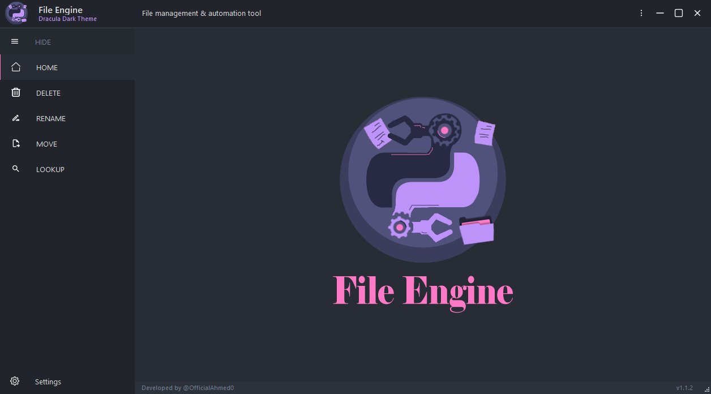
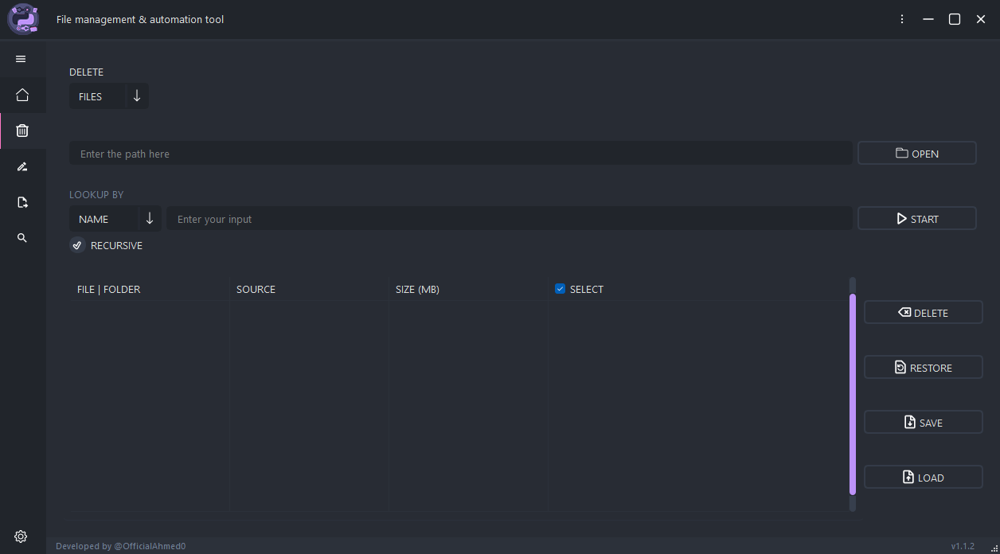

  

# INTRODUCTION

File Engine is a powerful and flexible file management and automation tool that simplifies the process of handling large files, searching for specific formats, and performing various file operations with ease.

# FEATURES

Search for files or folders recursively by:
- Full name
- Pattern
- File extention

### TODO LIST

- [x] **File Search:** Quickly search for files based on file format, name, or content.
- [ ] **Bulk Operations:** Perform batch operations such as:
  - [ ] Moving
  - [ ] Copying
  - [x] Deleting / Restoring files
  - [ ] Renaming
- [ ] **Automation:** Set up automated tasks to streamline your file management workflows.
- [x] **Cross-Platform:** Works seamlessly on Windows, macOS, and Linux.
- [x] **User-Friendly Interface:** A user-friendly interface makes it easy for both beginners and power users.
- [x] **Detect hidden attribute** Read Files/Folders flagged as hidden

# PREREQUISITES

- Python 3.1x
- [libraries](https://github.com/OfficialAhmed/File-Engine/blob/main/requirements.txt) 

**NOTE: This project is actively under development and may not be fully functional or stable yet. It's included for testing and evaluation purposes. Use it at your own risk, and feel free to provide feedback or report issues to help improve its quality.

# INTERFACE 

 
 

# LICENSE

File Engine - Copyright (C) 2023 OfficialAhmed

This software is free to use, distribute and/or modify it under the terms of the MIT License & Apache [READ](LICENSE)